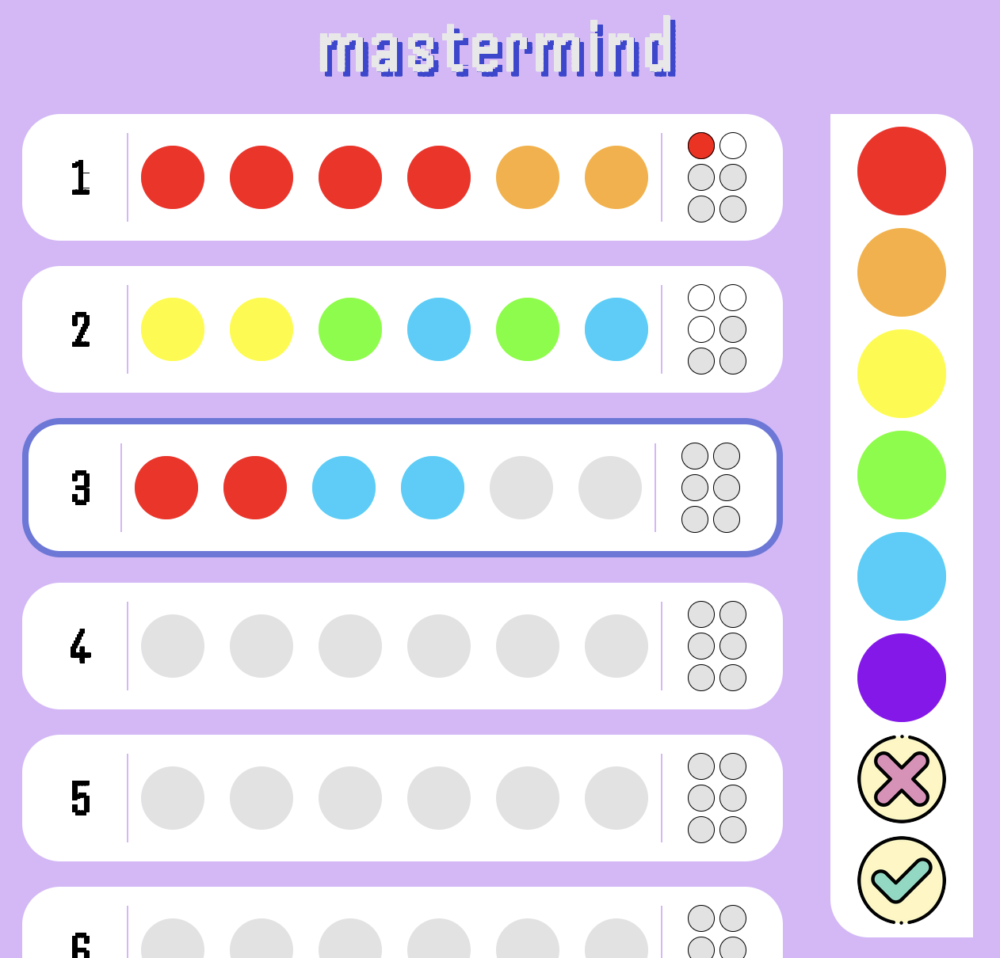
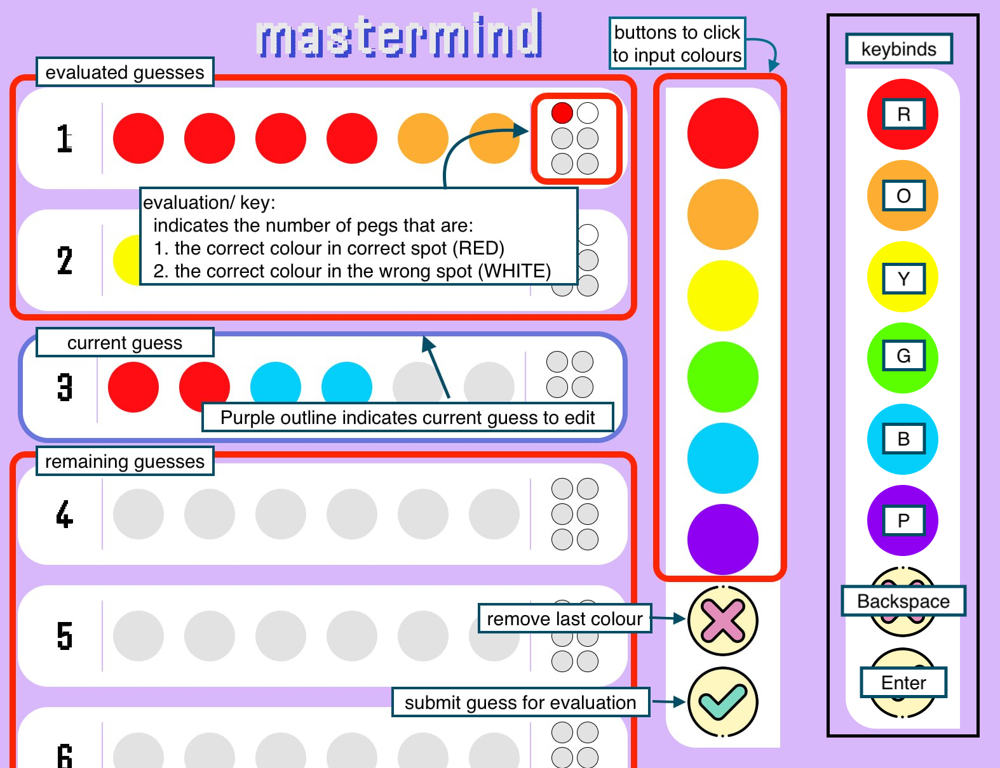

# 🕶️ mastermind

mastermind written in base html, css, js

[[play now]](https://game-mastermind.vercel.app)

## ❓ how to play

A hidden code of x coloured pegs is generated at the start of the game.

Try to find the code within the allotted number of guesses.

After each guess, an evaluation will show, indicating the number of pegs that are

- the correct colour in the correct spot
- the correct colour but in the wrong spot

If you guess the code - you win!

## 🎮 controls

## 📝 future developments

- [x] win/ lose message
- [ ] game instructions/ start game button
- [ ] settings button
  - [ ] game settings:
    - [ ] key length
    - [ ] no. of colour options
    - [ ] duplicates (t/f)
    - [ ] no. of total guesses
  - [ ] ui settings:
    - [ ] light/ dark mode
    - [ ] left/ right input
    - [ ] allow changing of keybinds
- [ ] responsive ui
